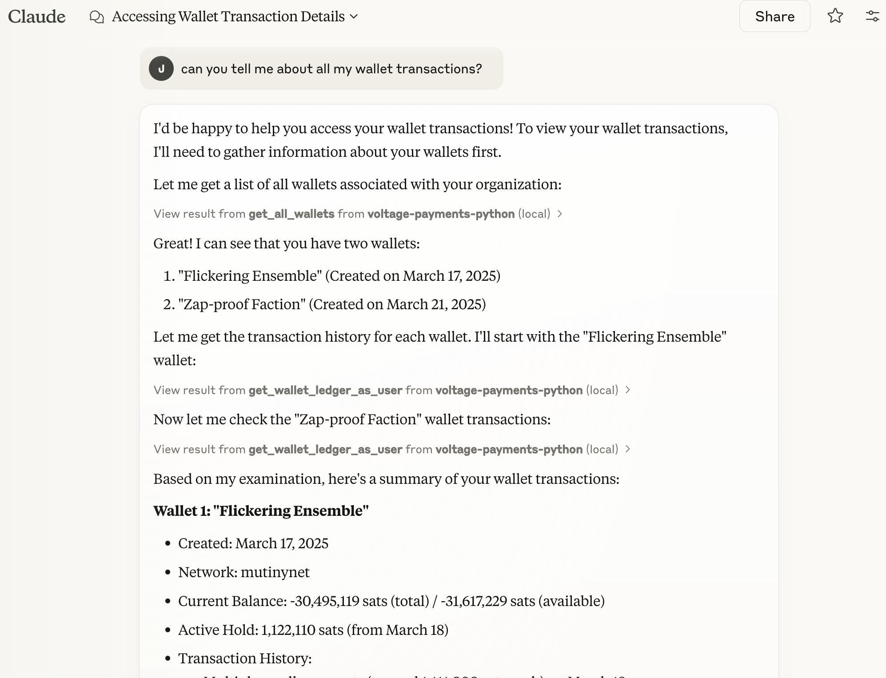

# Voltage Payments MCP Server

This repository contains a Model Context Protocol (MCP) server that provides a programmatic interface to the Voltage Payments API. The server dynamically exposes API endpoints as callable tools, allowing for seamless integration with AI assistants and other systems.

## Warning

This work was completed during FOSS Friday at Voltage and released as open source for educational purposes.  It should go without saying, (but hey, this is the internet, so who knows) but this can have unexpected side effects.  If you run this MCP server with an API key with _real money_, it can be used to make _real payments_.  Putting that kind of power into the hands of an LLM is #reckless.  I think it's kind of awesome, but know there could be surprises.

Use at your own risk, etc.

## Setup and Configuration

### Environment Variables

The server requires the following environment variables to be set:

- `API_KEY`: Your Voltage API key
- `ORGANIZATION_ID`: Your Voltage organization ID (UUID format)
- `ENVIRONMENT_ID`: Your Voltage environment ID (UUID format)
- `BASE_URL`: The base URL for the Voltage API (e.g., `https://api.voltage.cloud`)

### Configuring `claude_desktop_config.json`

To use this MCP server with Claude Desktop, you'll need to properly configure the `claude_desktop_config.json` file. This file tells Claude Desktop how to connect to your MCP server and what tools are available.

#### Location of the Config File

The `claude_desktop_config.json` file is typically located in:

- **macOS**: `~/Library/Application Support/Claude Desktop/claude_desktop_config.json`
- **Windows**: `%APPDATA%\Claude Desktop\claude_desktop_config.json`
- **Linux**: `~/.config/Claude Desktop/claude_desktop_config.json`

#### Configuration Structure

Here's how to structure your `claude_desktop_config.json` file:

```json
{
  "mcpServers": {
    "voltage-payments-python": {
      "command": "/path/to/uv",
      "args": [
        "run",
        "--with",
        "mcp[cli]",
        "mcp",
        "run",
        "/path/to/payment-mcp/server.py"
      ],
      "env": {
        "API_KEY": "your-api-key",
        "ORGANIZATION_ID": "organization-uuid",
        "ENVIRONMENT_ID": "environment-uuid",
        "BASE_URL": "https://backend.voltage.cloud"
      }
    }
  }
}
```

## Available Tools

The MCP server exposes the following tools for interacting with the Voltage Payments API:

### Wallet Operations
- **get_all_wallets**: Get all wallets for the organization
- **create_wallet**: Create a new wallet in the organization
- **get_wallet**: Get a specific wallet by its ID
- **delete_wallet**: Delete a specific wallet by its ID
- **get_wallet_ledger_as_user**: Get the ledger for a specific wallet

### Payment Operations
- **get_payments**: Get a list of payments with optional filtering
- **check_payment_status**: Check the status of a payment by its ID
- **generate_bolt11_invoice**: Generate a BOLT11 invoice for receiving a payment
- **pay_bolt11_invoice**: Pay a BOLT11 invoice

## Example Usage

Below is a screenshot showing the Voltage Payments MCP server in action with Claude:



## Running the Server Manually

If you prefer to run the server manually rather than through Claude Desktop's auto-start feature:

```bash
# Set environment variables
export API_KEY=your_api_key
export ORGANIZATION_ID=your_org_id
export ENVIRONMENT_ID=your_env_id
export BASE_URL=https://api.voltage.cloud

# Run the server
python server.py
```

## Security Considerations

- Store your API keys and other sensitive information securely.
- Do not commit your `claude_desktop_config.json` file with actual API keys to version control.
- Consider using environment variables or a secure secrets manager instead of hardcoding credentials.
